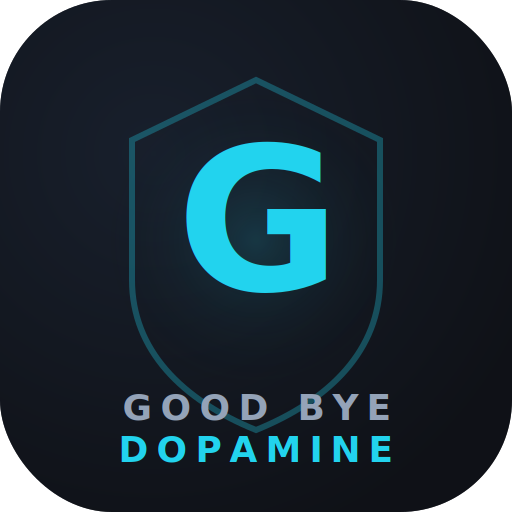

<p align="center">
  
</p>

<h1 align="center">GBD — Good Bye Dopamine</h1>

<p align="center">
  <strong>A gamified productivity suite for students who want to take back control of their time.</strong>
</p>

<p align="center">
  
  
  
  
  
  
</p>

<p align="center">
  <a href="https://goodbye-dopamine.lovable.app">Live App</a> · 
  <a href="#features">Features</a> · 
  <a href="#tech-stack">Tech Stack</a> · 
  <a href="#getting-started">Getting Started</a> · 
  <a href="#contributing">Contributing</a>
</p>

---

## 🎯 What is GBD?

GBD (Good Bye Dopamine) is an all-in-one academic and personal productivity web app designed for students. It combines task planning, exam tracking, financial management, reading lists, focus sessions, and more — all wrapped in a gamification layer that rewards you with XP and levels for staying productive.

Install it as an app on your phone or desktop — it works offline too.

---

## ✨ Features

### 📊 Dashboard
- Personalized welcome screen with daily inspirational quotes
- XP level progress bar and stats overview
- Customizable quick-access tiles for your most-used modules
- Configurable quick links to external resources

### 📅 Planner
- Create tasks with title, date, time, priority, and reminders
- Kanban-style workflow: Todo → In Progress → Done
- Earn XP for creating and completing tasks

### ⏰ Routine
- Weekly schedule builder (Monday–Sunday)
- Add class periods with subject, time, and room
- OCR import: snap a photo of your timetable and auto-import it

### 📝 Exams
- Track upcoming exams and assignments with countdown timers
- Fields for subject, date, time, credits, teacher, and room
- OCR import for bulk exam schedule entry
- Urgency indicators (critical / warning / safe)

### 🎓 Academic Hub
- **GPA Tracker**: Log courses per semester with grades and credits, auto-calculates semester GPA and cumulative CGPA
- **GPA Calculator**: Quick what-if calculations for hypothetical grades
- **GPA Simulator**: Project the GPA needed in remaining credits to hit your target CGPA

### 💰 Money Manager
- Track income and expenses with running balance
- **Debt Tracker**: Log money lent and borrowed, mark as settled
- **Savings Goals**: Set targets with progress tracking

### 📓 Notes
- Rich note-taking with categories (General, Study, Personal, Ideas)
- Full-text search across all notes
- Inline note viewer with edit and delete

### 📚 Booklist
- Personal reading library with status tabs: Reading / Want to Read / Finished
- Track pages read, star ratings, genres, and personal notes
- Reading progress stats (books read, pages completed)

### 🧘 Digital Detox
- Focus timer with customizable duration (5–120 min)
- Ambient sounds: Rain, Forest, Ocean, Lo-Fi, White Noise
- Growing tree visualization that evolves with total focus time
- Session history log

### ❤️ Health & Wellness
- Health tracking module (extensible)

### 📈 Reports
- Productivity analytics and insights

### 👤 Profile
- User profile with avatar upload (safe raster formats only), bio, institution, and academic details
- Account management and settings

### 🌗 Theming
- Light and dark mode with smooth transitions
- Toggle via sun/moon icon in the header
- Preference persisted across sessions

---

## 🎮 Gamification

Every productive action earns XP:

| Action | XP |
|---|---|
| Create a task | +10 |
| Complete a task | +20 |
| Add a routine period | +5 |
| Add an exam | +15 |
| Add a transaction / debt | +5 |
| Set a savings goal | +10 |
| Add a note | +10 |
| Add a book | +10 |
| Finish a book | +25 |
| Add a course | +10 |
| Focus session | +duration (min 5) |

**Level up every 100 XP.** XP is synced to the cloud via server-side atomic increments — tamper-proof and persistent across devices.

---

## 📱 Progressive Web App (PWA)

- **Installable**: Add to home screen on any device (iOS, Android, Desktop)
- **Offline support**: Full functionality without internet — data syncs when back online
- **Offline sync queue**: Failed database writes are queued and auto-retried on reconnection
- **Connection indicator**: Visual offline/online status badge in the header

---

## 🔒 Security

- **Row-Level Security (RLS)** on all database tables — users can only access their own data
- **Server-side XP increments** via `SECURITY DEFINER` Postgres function — no client-side score manipulation
- **JWT verification** on edge functions using `getUser()` for cryptographic token validation
- **Avatar upload allowlist** — only `jpeg`, `png`, `gif`, `webp` accepted; SVG/scripts blocked
- **Private storage buckets** with short-lived signed URLs for file access
- **Email OTP verification** required on signup — no anonymous accounts

---

## 🛠 Tech Stack

| Layer | Technology |
|---|---|
| **Framework** | React 18 + TypeScript |
| **Build Tool** | Vite |
| **Styling** | Tailwind CSS + shadcn/ui |
| **Icons** | Lucide React |
| **Backend** | Supabase (Auth, Database, Storage, Edge Functions) |
| **OCR** | Tesseract.js (offline, client-side) |
| **PWA** | vite-plugin-pwa + Workbox |
| **State** | React Context + localStorage (hybrid) |

---

## 🚀 Getting Started

### Prerequisites

- Node.js 18+ and npm (or bun)

### Installation

```bash
# Clone the repository
git clone https://github.com/<your-username>/goodbye-dopamine.git
cd goodbye-dopamine

# Install dependencies
npm install

# Start development server
npm run dev
```

The app will be available at `http://localhost:5173`.

### Environment Variables

The app requires the following environment variables (auto-configured on Lovable):

```
VITE_SUPABASE_URL=<your-supabase-url>
VITE_SUPABASE_PUBLISHABLE_KEY=<your-supabase-anon-key>
```

---

## 📂 Project Structure

```
src/
├── components/
│   ├── gbd/               # App-specific components
│   │   ├── pages/         # All page components (Dashboard, Planner, etc.)
│   │   ├── AppShell.tsx   # Main app layout
│   │   ├── AuthScreen.tsx # Login/signup screen
│   │   ├── Sidebar.tsx    # Navigation sidebar
│   │   └── TopHeader.tsx  # Top bar with status & notifications
│   └── ui/                # shadcn/ui components
├── hooks/                 # Custom hooks (gamification, online status)
├── lib/                   # Utilities (storage, quotes, sync queue)
├── integrations/          # Supabase client & types
└── pages/                 # Route-level pages
```

---

## 🤝 Contributing

Contributions are welcome! Here's how you can help:

1. **Fork** the repository
2. **Create a branch** for your feature or fix: `git checkout -b feat/my-feature`
3. **Commit** your changes with a clear message: `git commit -m "feat: add awesome feature"`
4. **Push** to your branch: `git push origin feat/my-feature`
5. **Open a Pull Request** describing what you changed and why

### Guidelines

- Follow the existing code style (TypeScript, functional components, Tailwind tokens)
- Keep PRs focused — one feature or fix per PR
- Test your changes locally before submitting
- Update the README if you add new features
- Be respectful and constructive in discussions

### Reporting Bugs

Open an issue with:
- Steps to reproduce
- Expected vs actual behavior
- Screenshots if applicable
- Device / browser info

---

## 📜 Code of Conduct

We are committed to providing a welcoming and inclusive experience for everyone. All participants are expected to:

- **Be respectful** — Treat everyone with dignity regardless of background or experience level
- **Be constructive** — Offer helpful feedback; avoid personal attacks or dismissive language
- **Be collaborative** — Work together toward shared goals; welcome newcomers
- **Be accountable** — If you make a mistake, own it, learn from it, and move on

Harassment, discrimination, and abusive behavior will not be tolerated. Maintainers reserve the right to remove, edit, or reject contributions that violate these principles.

---

## 📄 License

This project is open source and available under the [MIT License](LICENSE).

---

<p align="center">
  Built with ❤️ using <a href="https://lovable.dev">Lovable</a>
</p>
